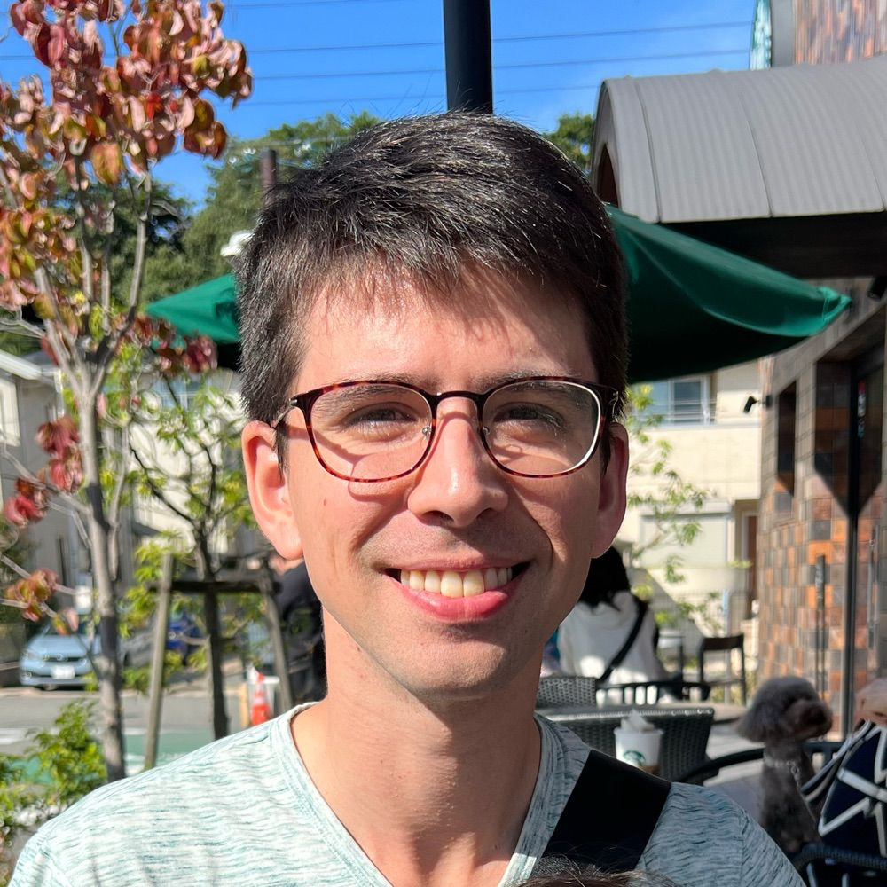

## About this site

In addition to being a blog, this is a freeform space for me to build – and hopefully grow – a personal knowledge-base. My [main website](https://www.invisibleparade.com) is a space for my thoughts and longer written posts, and has more information about me.

I write notes using [Obsidian](https://obsidian.md), and use [Quartz](https://quartz.jzhao.xyz) to transform my notes into a functional website.

These pages might be a good start:

- [Posts](/posts) for a list of all blog posts
- [Links](/links) is a list of interesting sites I have linked to
- [Colophon](/tags/colophon) for information about how this site is built

I'm still not sure what the best way to organize things is here, so they might be a lot of reorganizing for a while.

For now, the vision is to just tag everything and see what happens. Maybe I will make a tag cloud to aid exploration. Maybe I will expose a list of related pages for each page. I'm not sure yet, but I think I have a lot of options.

Please note that this site has a great search function. You can use the search bar in the upper-left, or press  `⌘`/`ctrl` + `K`. 

## About me

My name is Alex. I grew up near Boulder, CO and spent most of my childhood reading books, playing music, and playing video games. I learned programming by making bad games for my TI-83 calculator. The first things I published online were bad flash websites.

In college I studied programming and human-computer interaction. A team of classmates and I made [a few apps](http://www.sfgate.com/news/article/These-Stanford-Students-Made-Millions-Taking-A-2361888.php) on Facebook, which eventually turned into a startup. This was the first time I made something that was used by a large number of people. It became my introduction to making real products that have users and make money.

I have been working at a mobile game company in Japan since 2010. Because my day-job does`n't currently involve much programming, I like to work on [fun projects](https://invisibleparade.com/projects/) on the side that let me build things directly.

Part of the reason I maintain this site is the hope that it will help me make more connections online. Please feel free to [get in touch](https://invisibleparade.com/contact/)! It would make me very happy.

Here are some other pages that may be interesting:

- [[now]]: What I am doing now
- [[media]]: A log of the media I enjoyed (or not)
- [[future]]: My thoughts and hopes about the rest of my life
- [[past]]: Looking back on how things went